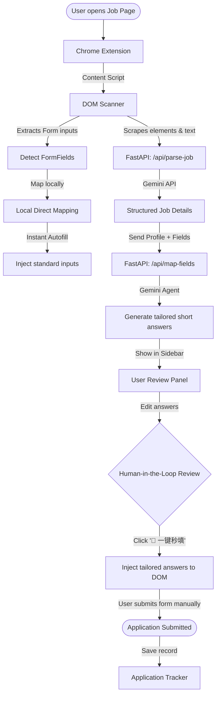

<p align="center">
  
</p>

<h1 align="center">ApplyPilot AI 🚀</h1>

<p align="center">
  <strong>An advanced, privacy-first, browser-based AI job application agent.</strong>
</p>

<p align="center">
  
  
  
  
  
  
  
</p>

---

## 💡 Overview

**ApplyPilot AI** is an advanced browser companion designed to strip the friction out of job hunting while keeping you firmly in control. It instantly autofills complicated job application fields and synthesizes highly tailored, job-specific short answers using the power of Gemini AI. 

Operating directly inside a Manifest V3 Chrome Extension, it acts as a smart sidebar overlay compatible with all major job portals (LinkedIn, Greenhouse, Lever, Ashby, and more).

---

## 📸 Showcase

<p align="center">
  
  
</p>

---

## 🔒 Core Philosophy

### 1. Privacy-First (Local-First Design)
Candidate information is highly sensitive. To address security and data ownership concerns:
* **Local Storage**: Your primary `ProfileVault` (personal details, resumes, contact details) is stored strictly client-side inside `chrome.storage.local`. It never stays or lives on our servers.
* **Stateless API Processing**: The backend FastAPI serves as a stateless "reasoning agent." It takes the job details and specific profile facts, sends them securely to the Gemini API to write responses, and returns them immediately without storing candidate profiles in any cloud database.
* **Dashboard Tracking**: The optional database integration strictly records high-level metadata (date, company, role, status) to power a visual application tracking dashboard, ensuring complete absence of personal credentials.

### 2. Double-Engine Form Autofilling
* **Engine A: Instant Local Mapping**: To create an instantaneous, magical pre-fill experience, a lightweight Content Script DOM scanner maps standard HTML inputs (Name, Email, Phone, Social URLs) against the local profile data instantly (< 100ms). Prefilled fields glow in soft purple for high-visibility visual confirmation.
* **Engine B: LLM/Gemini Field Categorization**: For complex elements (e.g. drop-down options, demographic/EEO declarations, or open-ended custom questions), ApplyPilot packs the fields and job details, leveraging a FastAPI reasoning agent powered by `gemini-2.5-flash` to execute structured, high-accuracy semantic mappings.

### 3. Human-in-the-Loop Safety
ApplyPilot is a smart assistant, not an automated spammer. 
* It **never** clicks the submit button automatically.
* All synthesized short-answers are displayed in a clean glassmorphic review panel in the sidebar, allowing you to review, adjust, and fine-tune every word before injecting them into the page.

---

## 🛠️ Technical Highlights & Breakthroughs

### 🔓 Bypassing React DOM State Lock
Modern web forms built using React or Vite often intercept standard programmatic inputs. Setting `.value` on HTML elements directly fails to trigger React's internal virtual DOM state updates, causing forms to appear empty upon submission. 
* **The Solution**: ApplyPilot intercepts the element's prototype and dynamically dispatches synthetic `input` and `change` events. This bypasses the virtual DOM state lock and ensures full synchronization of input elements during autofill injection.

### 📄 High-Fidelity Client-Side PDF Generation
ApplyPilot includes a custom cover letter generator that translates candidate profiles and scanned job specifications into a beautifully structured, tailored cover letter.
* **The Solution**: Built client-side using `jsPDF`, the layout engine compiles custom career details, replaces placeholders dynamically with current dates, and applies precise typographical hierarchies with rigid **20mm margins** for immediate PDF download directly from the sidebar.

---

## 🏗️ System Architecture



---

## 💻 Tech Stack & Component Matrix

| Component | Directory | Core Technologies | Role & Functionality |
| :--- | :--- | :--- | :--- |
| **Chrome Extension** | `extension/` | React 18, Vite, TypeScript, TailwindCSS, jsPDF | Scrapes job application forms (LinkedIn, Lever, Ashby, Greenhouse), manages local profile vault in `chrome.storage.local`, provides sidebar panel chat co-pilot UI, generates and downloads custom cover letter PDFs. |
| **Backend API** | `backend/` | FastAPI, Python 3.10+, PyPDF, BeautifulSoup4, Uvicorn | Stateless REST API parsing unstructured job webpages, extracting resume PDFs/TXTs into structured schemas, and mapping complex form questions via Gemini AI. |
| **AI Agent Reasoner** | `backend/app/agents/` | Google GenAI SDK, `gemini-2.5-flash` | Executes semantic matching, maps custom demographics/EEO checkboxes, writes professional first-person short-answers and cover letters. |

---

## 🚀 Quick Start Guide

### 1. Backend Setup (FastAPI)

```bash
# Navigate to the backend directory
cd backend

# Create a virtual environment
python -m venv venv

# Activate the virtual environment
# On Windows:
.\venv\Scripts\activate
# On macOS/Linux:
source venv/bin/activate

# Install dependencies
pip install -r requirements.txt

# Create your local environment file
cp .env.example .env

# Edit .env and supply your GEMINI_API_KEY:
# GEMINI_API_KEY=your_key_here

# Start the development API server
uvicorn app.main:app --reload --port 8000
```
*The backend API will now be running locally at `http://localhost:8000`. You can inspect endpoints and interactive API documentation at `http://localhost:8000/docs`.*

### 2. Chrome Extension Setup (React + TS + Vite)

```bash
# Navigate to the extension directory
cd extension

# Install dependencies
npm install

# Start Vite HMR developer server
npm run dev
```

#### Load the Extension into Google Chrome:
1. Open Chrome and navigate to `chrome://extensions/`.
2. Toggle on **Developer mode** in the top-right corner.
3. Click the **Load unpacked** button in the top-left.
4. Select the `extension/dist` folder (generated by Vite in the step above).
5. Open any job application page (e.g. LinkedIn, Greenhouse), pin **ApplyPilot AI**, and click the icon to launch the sidebar panel!
