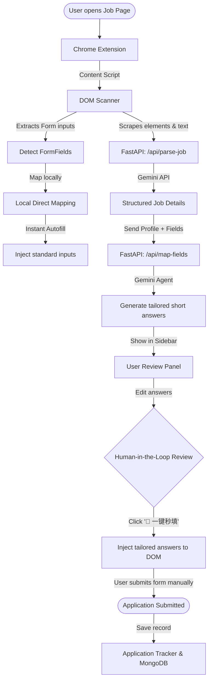

# ApplyPilot AI - System Architecture 🚀

This document details the multi-step agentic workflow and the architecture of **ApplyPilot AI**.

---

## 🔒 1. Privacy-First "Local-First" Architecture

Candidate information is highly sensitive. To address user concerns:
1. **Local Storage**: The candidate's `ProfileVault` is stored directly inside the browser using `chrome.storage.local`. It never stays or lives on our servers.
2. **Stateless API Processing**: The backend FastAPI serves as a stateless "reasoning agent." It takes the job details and specific profile facts, sends them securely to Gemini to write responses, and returns them immediately without storing candidate profiles in the cloud database.
3. **Tracking Dashboard**: The MongoDB database stores application records (date, company, role, status) to power the user's dashboard, strictly omitting personal credentials or resumes.

---

## ⚡ 2. Double-Engine Form Detection & Autofill

### Engine A: Direct Local Mapping
To create an instantaneous, magical "instant fill" user experience:
- When the extension is clicked, a lightweight Content Script DOM scanner maps standard HTML inputs (Name, Email, Social URLs) against the local profile data instantly.
- Within **100 milliseconds**, standard inputs are prefilled and highlighted in soft purple.

### Engine B: LLM/Gemini Field Categorization & Answer Synthesis
For complex forms (e.g. drop-down options or open-ended custom questions):
1. **Input Packing**: The Form Fields (labels, field types, select options) and Job Details are packed.
2. **LLM Reasoner**: The FastAPI Agent reads this payload alongside the candidate profile facts.
3. **Structured Mapping**: Gemini classifies complex select lists (e.g. matching standard legal statements to custom checkbox labels) and synthesizes bespoke, job-specific answers that are highly tailored to the company's requirements.

---

## 👤 3. Human-in-the-Loop Safety

ApplyPilot AI is an assistant, not an automated spammer. It adheres to strict principles:
- **No Automatic Submission**: The extension will **never** click the submit button automatically.
- **Editable Drafts**: All generated short-answer drafts are displayed in a clean, glassmorphic review panel in the sidebar, letting the candidate review and fine-tune every word before injection.
- **Visual Highlights**: Autofilled fields on the webpage are briefly highlighted with a warm purple glow, letting the candidate visually inspect where and what values were inputted.
